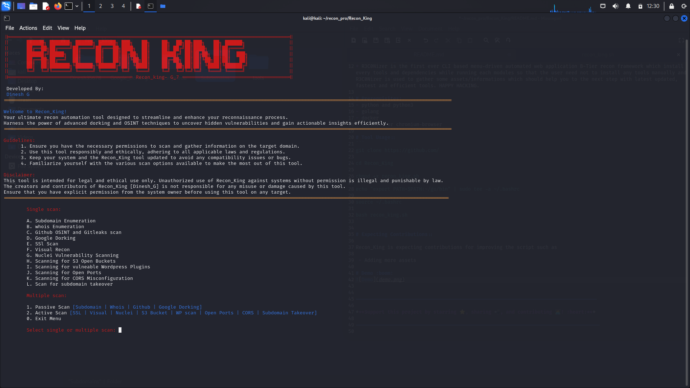

```
||=====================================================================================||
||	██████╗ ███████╗ ██████╗ ██████╗ ███╗   ██╗    ██╗  ██╗██╗███╗   ██╗ ██████╗ 		   ||
||	██╔══██╗██╔════╝██╔════╝██╔═══██╗████╗  ██║    ██║ ██╔╝██║████╗  ██║██╔════╝ 		   ||
||	██████╔╝█████╗  ██║     ██║   ██║██╔██╗ ██║    █████╔╝ ██║██╔██╗ ██║██║  ███╗		   ||
||	██╔══██╗██╔══╝  ██║     ██║   ██║██║╚██╗██║    ██╔═██╗ ██║██║╚██╗██║██║   ██║		   ||
||	██║  ██║███████╗╚██████╗╚██████╔╝██║ ╚████║    ██║  ██╗██║██║ ╚████║╚██████╔╝		   ||
||	╚═╝  ╚═╝╚══════╝ ╚═════╝ ╚═════╝ ╚═╝  ╚═══╝    ╚═╝  ╚═╝╚═╝╚═╝  ╚═══╝ ╚═════╝ 		   ||
||===================================== Recon_king- G_7 ===============================||  
```
# About Recon_King:
* Recon_King is the first ever CLI based menu-driven automated web application B-Tier recon framework which install every tools and dependencies while running each modules so that the user need not to install any tools manually and Recon_King is used to gather some assets/informations which should help you to the next step with latest updated, fastest and efficient tools. HAPPY HACKING.

# Prerequisites:
- python and python3
- golang
- docker

# Tool Usage::
```
git clone https://github.com/

cd Recon_King

chmod +x recon_king.sh 

echo "export PATH=$PATH:~/go/bin" | sudo tee -a ~/.bashrc

source ~/.bashrc

bash recon_king.sh
```

# Expecting Contributions::

Recon_King is expecting contributions for improving the script such as Adding more tools and Report Generation.

# Demo :boom:



------------------------------------------------------------------------------------

***Support this project by starring ⭐, sharing 📲, and contributing 👩‍💻! :heart:***

-------------------------------------------------------------------------------------
